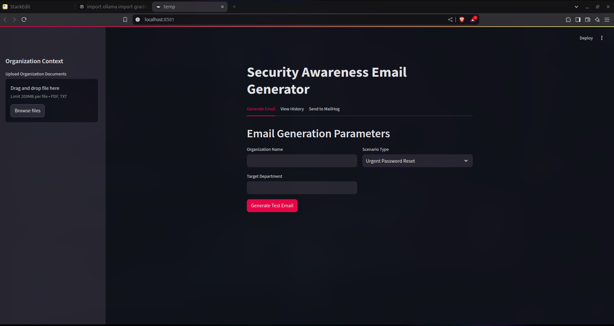
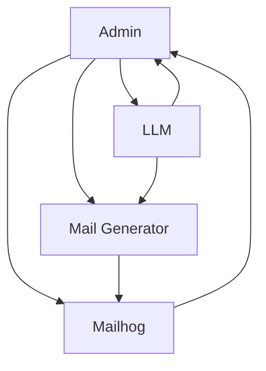

# HookLess

<b>An AI agent for creating realistic phishing simulation for security training purposes



## Table of Contents
- [Overview](#overview)
- [Key Features](#key-features)
- [Prerequisites](#prerequisites)
- [Installation](#installation)
- [Usage Guide](#usage-guide)
- [License](#license)

This AI Agent enables security teams to:
- Generate realistic phishing emails using organizational context
- Maintain historical records of simulated campaigns
- Conduct security awareness training exercises

Built with:
- **Streamlit** for UI/UX
- **Ollama** (DeepSeek-R1 1.5B model) for email generation
- **PyMuPDF** for document processing
- **MailHog** for email testing

## Key Features

### Core Functionality
| Feature | Description |
|---------|-------------|
| Document Context Integration | Process PDF/TXT documents to inform email content |
| Scenario Customization | 9 predefined phishing scenarios + custom options |
| MailHog Integration | Safe email testing environment |
| Historical Tracking | Scenario history storage |
| Multi-Department Support | Target specific organizational units |

### Security Features
- Local document storage encryption
- Local Gen AI model(DeepSeek R1 1.5B parameter for testing) for sensitive data isolation
- MailHog sandboxing to simulate mail servers
- Audit trails for generated content to understand high risk individuals

## Prerequisites

**Required Services for Emulation:**
1. **Ollama** (with DeepSeek-R1 1.5B model)
   ```bash
   ollama pull deepseek-r1:1.5b
   ```
2. **MailHog** (Docker recommended) (run locally if possible)
   ```bash
   docker run -d -p 1025:1025 -p 8025:8025 mailhog/mailhog
   ```

## Installation

1. Clone repository
   ```bash
   git clone https://github.com/Wanderer0074348/DoofenshmirtzEvil.git
   cd DoofenshmirtzEvil
   ```


2. Set up environment
   ```bash
   uv venv 
   source .venv/bin/activate
   ```

3. Install dependencies
   ```bash
   uv pip install -r requirements.txt
   ```

   ```bash
   mkdir -p saved_documents
   touch phishing_scenarios.json
   ```


### File Structure
```
├── main.py                # Main application
├── saved_documents/       # Uploaded organizational docs
├── phishing_scenarios.json# Scenario history
└── requirements.txt       # Dependencies
```
## Run Command
```bash
uv run streamlit run main.py
```

## Usage Guide

### 1. Document Upload


- Supported formats: PDF, TXT
- Max file size: 50MB

### 2. Email Generation
**Parameters:**
- Organization Name
- Target Department
- Scenario Type (9 presets + custom)

**Generation Process:**
1. Select scenario parameters
2. Click "Generate Test Email"
3. Review output in markdown format

### 3. MailHog Testing
```bash
sudo apt-get -y install golang-go
go get github.com/mailhog/MailHog
```

```bash
# Send test email
curl http://localhost:8025/api/v2/messages
```

1. Copy generated email content
2. Paste into "Send to MailHog" tab
3. Enter target email address
4. Click send

## Customization

### Modify Prompt Template
Edit `PHISHING_PROMPT_TEMPLATE` in code:
```python
PHISHING_PROMPT_TEMPLATE = """
[Your custom template here]
"""
```

### Add New Scenario Types
1. Edit scenario selection dropdown
2. Update prompt template logic
3. Modify history tracking parameters

## License

Copyright (C) [2025] [Wanderer0074348]  
This program is free software; you can redistribute it and/or modify it under the terms of the GNU General Public License as published by the Free Software Foundation; version 2 of the License.  
